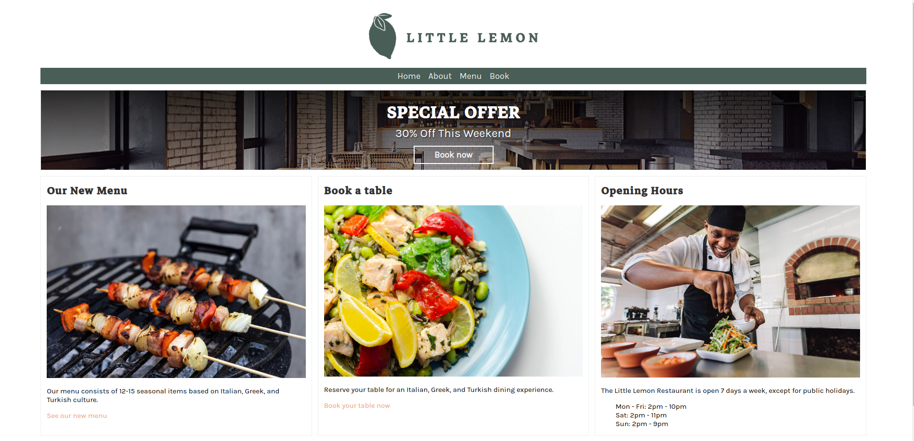

# Little-Lemon 🍋

<br>

Little Lemon is a charming neighborhood bistro that serves simple food and classic cocktails in a lively but casual environment. The restaurant features a locally sourced menu with daily specials. 

The restaurant is in the process of transition from a one-page website to a database driven web application using the Django framework. Currently, the pages for Home, About and Book are completed.

For the menu page, the owners would like to store the menu information in a database that can be updated as the menu changes seasonally. 

<hr>

- Home page:




<hr>

## `Installing`
```bash
# downloading the project
gh repo clone niraj2099M/meta-littlelemon
```
### After that, you need to open the project in your IDE and run it.
`cd castpone`


- ## Command to perform migrations
`python3 manage.py makemigrations`

`python3 manage.py migrate`

- ## Command to run server
`python3 manage.py runserver`


